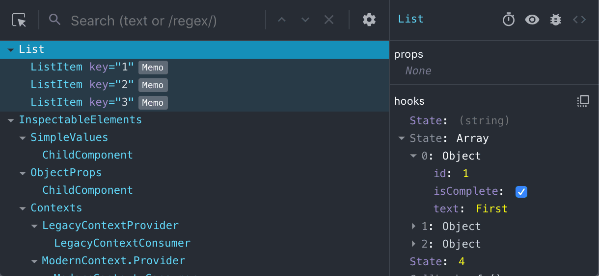
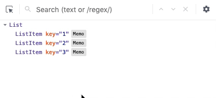

## O que mudou?

Muito mudou na versão 4! Resumidamente, esta nova versão deve oferecer ganhos significantes de performance e uma experiência de navegação melhorada. Ela também oferece suporte completo para React Hooks, incluindo a possibilidade de inspecionar objetos aninhados.

## \
Para onde foram todos os elementos do DOM?

O novo DevTools provê uma maneira de filtrar os componentes da árvore para facilitar a navegação de hierarquias profundamente aninhadas. Host nodes (por exemplo, HTML`
`, React Native`<View>`) são *escondidos por padrão*, mas este filtro pode ser desabilitado:

